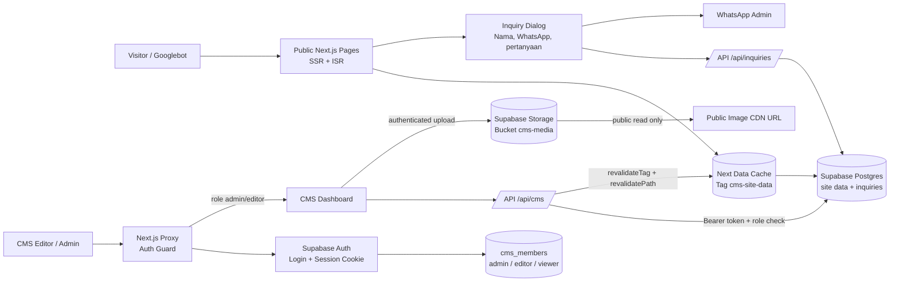

# Arsitektur Produksi Risalah Madina Tour

Diagram ini mengikuti alur yang saat ini diimplementasikan di aplikasi.

## Batas keamanan

- `/admin/*` melewati `proxy.ts`. User tanpa session Supabase atau tanpa role `admin`/`editor` diarahkan ke `/admin/login`.
- `cms_site_data` dapat dibaca publik, tetapi insert/update hanya untuk editor/admin. Penghapusan data dan aksi reset data hanya dapat dilakukan oleh role `admin`.
- Optimistic Concurrency Control: `/api/cms` membandingkan `updated_at` sebelum menulis data dan mengembalikan `409 Conflict` jika data telah ditimpa oleh sesi editor lain.
- Riwayat snapshot lengkap disimpan otomatis oleh Postgres Trigger ke tabel `cms_audit_log` untuk setiap insert/update/delete.
- Bucket `cms-media` sengaja public-read agar gambar website dapat dimuat CDN, dengan pembatasan ukuran file maksimal 8MB (`file_size_limit = 8388608`) dan whitelist MIME type gambar saja. Upload/update memerlukan editor/admin, sedangkan delete hanya admin.
- `cms_inquiries` menerima insert anonim yang dibatasi statusnya (`status = 'new'`) serta panjang seluruh field-nya (`package_id`, `package_name`, `contact_name`, `contact_phone`, `message`, `source_path`, `referrer`, `user_agent`). Read hanya untuk editor/admin. Data kontak tidak ikut dikirim ke URL WhatsApp.
- Service role key tidak dipakai di browser dan tidak dibutuhkan untuk operasi normal CMS.

## Rendering dan SEO

- Data CMS dibungkus `unstable_cache` dengan tag `cms-site-data` dan revalidasi 5 menit.
- Halaman detail Umroh dan Haji memakai `generateStaticParams`, `revalidate = 300`, canonical URL, Open Graph, dan JSON-LD `Product`/`Offer`.
- Setelah CMS menyimpan perubahan, route `/api/cms` menjalankan invalidasi tag dan layout agar perubahan global terlihat tanpa build ulang.
- Slug baru tetap dapat dibuat on-demand oleh Next.js melalui dynamic params.

## Urutan migration Supabase

Jalankan berurutan di Supabase SQL Editor:

1. `supabase/migrations/001_cms.sql`
2. `supabase/migrations/002_cms_media.sql`
3. `supabase/migrations/003_enterprise_security_and_inquiries.sql`
4. `supabase/migrations/004_security_hardening.sql`

Setelah itu buat user di Supabase Auth, lalu masukkan UUID-nya ke `cms_members` sebagai `admin` atau `editor`.
